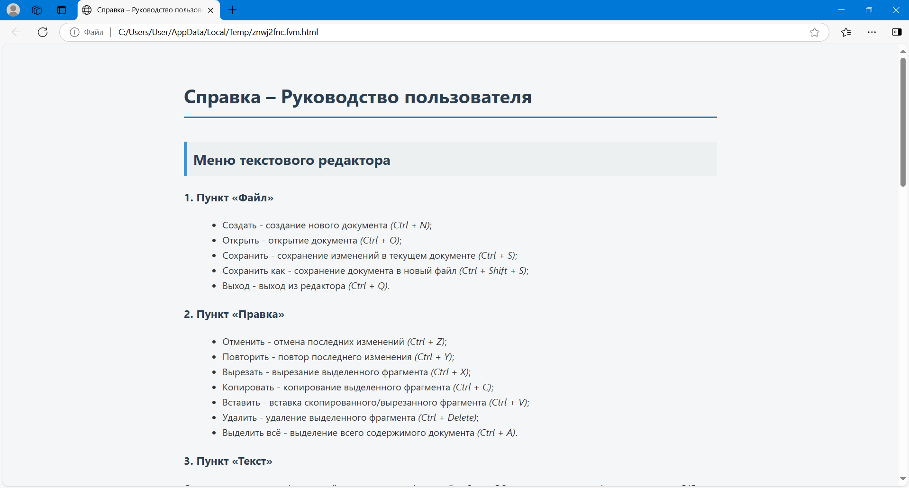
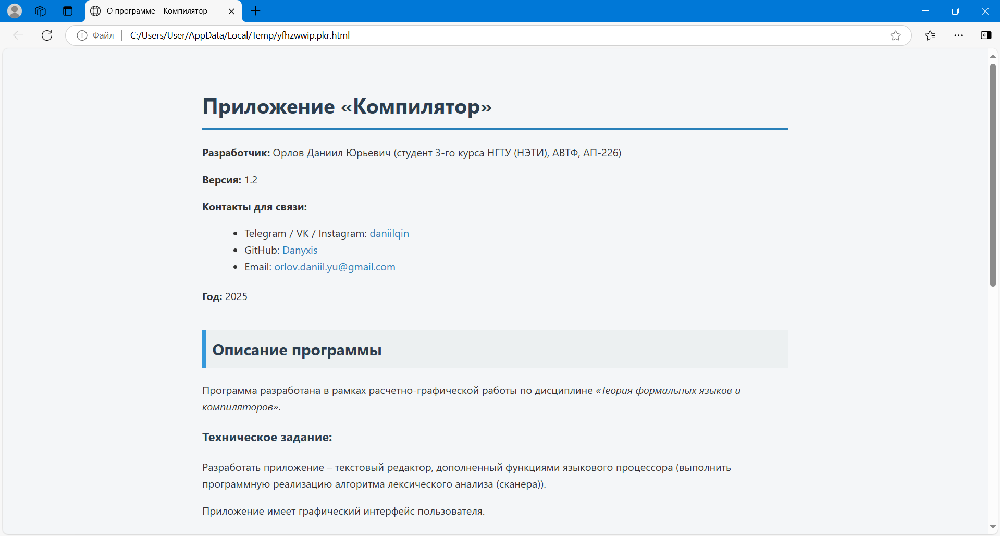

# Компилятор (CompilerApp)

Разработка текстового редактора с функциями языкового процессора.


## Содержание

- [Лабораторная работа №1: Разработка пользовательского интерфейса (GUI) для языкового процессора](#лабораторная-работа-1-разработка-пользовательского-интерфейса-gui-для-языкового-процессора)
- [Лабораторная работа №2: Разработка лексического анализатора (сканера)](#лабораторная-работа-2-разработка-лексического-анализатора-сканера)
- [Лабораторная работа №3: Разработка синтаксического анализатора (парсера)](#лабораторная-работа-3-разработка-синтаксического-анализатора-парсера)
- [Лабораторная работа №4: Нейтрализация ошибок (метод Айронса)](#лабораторная-работа-4-нейтрализация-ошибок-метод-айронса)
- [Лабораторная работа №5: Включение семантики в анализатор. Создание внутренней формы представления программы](#лабораторная-работа-5-включение-семантики-в-анализатор-создание-внутренней-формы-представления-программы)
- [Лабораторная работа №6: Реализация алгоритма поиска подстрок с помощью регулярных выражений](#лабораторная-работа-6-реализация-алгоритма-поиска-подстрок-с-помощью-регулярных-выражений)
- [Лабораторная работа №7: Преобразование и анализ кода с использованием Clang и LLVM](#лабораторная-работа-7-преобразование-и-анализ-кода-с-использованием-clang-и-llvm)
- [Лабораторная работа №8: Реализация метода рекурсивного спуска для синтаксического анализа](#лабораторная-работа-8-реализация-метода-рекурсивного-спуска-для-синтаксического-анализа)


## Лабораторная работа №1: Разработка пользовательского интерфейса (GUI) для языкового процессора
**Тема:** Разработка текстового редактора с возможностью дальнейшего расширения функционала до языкового процессора.

**Цель работы:** Разработать приложение с графическим интерфейсом пользователя, способное редактировать текстовые данные. Это приложение будет базой для будущего расширения функционала в виде языкового процессора.

**Язык реализации:** C#, Windows Forms.

### Интерфейс текстового редактора


## Справка – Руководство пользователя приложения «Компилятор»

### Меню текстового редактора

#### 1. Пункт «Файл»

   В данном пункте меню реализован следующий функционал:

   - **Создать** - создание нового документа (*Ctrl + N*);
   - **Открыть** - открытие документа (*Ctrl + O*);
   - **Сохранить** - сохранение изменений в текущем документе (*Ctrl + S*);
   - **Сохранить как** - сохранение документа в новый файл (*Ctrl + Shift + S*);
   - **Выход** - выход из редактора (*Ctrl + Q*).


#### 2. Пункт «Правка»
   
   В данном пункте меню реализован следующий функционал:
   
   - **Отменить** - отмена последних изменений (*Ctrl + Z*);
   - **Повторить** - повтор последнего изменения (*Ctrl + Y*);
   - **Вырезать** - вырезание выделенного фрагмента (*Ctrl + X*);
   - **Копировать** - копирование выделенного фрагмента (*Ctrl + C*);
   - **Вставить** - вставка скопированного/вырезанного фрагмента (*Ctrl + V*);
   - **Удалить** - удаление выделенного фрагмента (*Ctrl + Delete*);
   - **Выделить всё** - выделение всего содержимого документа (*Ctrl + A*).


#### 3. Пункт «Текст»
   
   При вызове команд этого пункта меню - в браузере открываются HTML-документы с соответствующей 
   информацией по расчетно-графической работе «Объявление прототипа функции на языке C/C++». 
   Данный пункт меню содержит следующую информацию:

   - Постановка задачи;
   - Грамматика;
   - Классификация грамматики;
   - Метод анализа;
   - Диагностика и нейтрализация ошибок;
   - Тестовые примеры;
   - Список литературы;
   - Исходный код программы.


#### 4. Пункт «Пуск»

   - При нажатии на этот пункт происходит запуск работы языкового процесса.


#### 5. Пункт «Справка»

   При вызове команд этого пункта меню - в браузере открываются HTML-документы с соответствующей информацией.
   В данном пункте меню реализован следующий функционал:
   - **Вызов справки** - вызов справочной системы приложения (*F1*);
   - **О программе** - просмотр информации о программе.


| Раздел | Изображение |
| ------ | ------ |
| Вызов справки |  |
| О программе |  |

### Панель инструментов текстового редактора

   На данном элементе интерфейса содержатся кнопки для вызова часто используемых пунктов меню:
   - Создание нового документа;
   - Открытие документа;
   - Сохранение изменений в текущем документе;
   - Изменение размеров текста в окне редактирования и окне вывода результатов;
   - Отмена последних изменений;
   - Повтор последних действий;
   - Копирование выделенного фрагмента;
   - Вырезание выделенного фрагмента;
   - Вставка скопированного/вырезанного фрагмента;
   - Запуск работы языкового процесса;
   - Вызов справки программы;
   - Вызов информации о программе.


### Поведение интерфейса и взаимодействие с пользователем

   - Пользователь имеет возможность изменять размер окна приложения;
   - Предусмотрены минимальные ограничения размера окна приложения;
   - Пользователь имеет возможность изменять соотношение размеров области редактирования и области вывода результатов 
   с помощью разделителя между ними;
   - В окне редактирования и области вывода результатов, при необходимости, появляется полоса прокрутки;
   - При открытии нового файла или выходе из программы приложение предлагает сохранить изменения в файле, 
   если пользователь редактировал текст.


### Дополнительные возможности текстового редактора

   - Нумерация строк в окне редактирования текста;
   - В программе реализована функция Drag’n’drop – открытие документов при перетаскивании их в рабочую область программы;
   - Наличие строки состояния для отображения текущей информации о состоянии работы приложения;
   - Интерфейс с вкладками, позволяющий работать с разными модулями программы (для окна вывода результатов);
   - Отображение результатов в окне вывода в виде таблицы;
   
   **Горячие клавиши:**

   - <kbd>Ctrl</kbd> + <kbd>N</kbd> — создание нового файла  
   - <kbd>Ctrl</kbd> + <kbd>O</kbd> — открытие файла  
   - <kbd>Ctrl</kbd> + <kbd>S</kbd> — сохранение файла  
   - <kbd>Ctrl</kbd> + <kbd>Shift</kbd> + <kbd>S</kbd> — сохранение файла как  
   - <kbd>Ctrl</kbd> + <kbd>Q</kbd> — выход из приложения  
   - <kbd>Ctrl</kbd> + <kbd>Z</kbd> — отмена действия  
   - <kbd>Ctrl</kbd> + <kbd>Y</kbd> — повтор действия  
   - <kbd>Ctrl</kbd> + <kbd>X</kbd> — вырезать  
   - <kbd>Ctrl</kbd> + <kbd>C</kbd> — копировать  
   - <kbd>Ctrl</kbd> + <kbd>V</kbd> — вставить  
   - <kbd>Ctrl</kbd> + <kbd>Delete</kbd> — удалить  
   - <kbd>Ctrl</kbd> + <kbd>A</kbd> — выделить всё  
   - <kbd>F1</kbd> — вызов справки


## Лабораторная работа №2: Разработка лексического анализатора (сканера)

**Тема:** Разработка лексического анализатора (сканера).

**Цель работы:** Изучить назначение лексического анализатора. Спроектировать алгоритм и выполнить программную реализацию сканера.

| № | Тема | Пример верной строки | Справка |
| ------ | ------ | ------ | ------ |
| 22 | Объявление прототипа функции на языке C/C++ | float calculateRectangleArea(float length, float width); | [Ссылка на материал](https://www.geeksforgeeks.org/function-prototype-in-c/) |

**В соответствии с вариантом задания необходимо:**

   1. Спроектировать диаграмму состояний сканера.
   2. Разработать лексический анализатор, позволяющий выделить в тексте лексемы, иные символы считать недопустимыми (выводить ошибку).
   3. Встроить сканер в ранее разработанный интерфейс текстового редактора. Учесть, что текст для разбора может состоять из множества строк.

**Входные данные:** строка (текст программного кода).

**Выходные данные:** последовательность условных кодов, описывающих структуру разбираемого текста с указанием места положения и типа («число», «идентификатор», «знак», «недопустимый символ» и т.д.). Например, для строки:
```csharp
int x = 123;
```
<pre>
14 - ключевое слово - int - с 1 по 3 символ
11 - разделитель - (пробел) - с 4 по 4 символ
2 - идентификатор - x - с 5 по 5 символ
10 - оператор присваивания - = - с 6 по 6 символ
1 - целое без знака - 123 - с 7 по 9 символ
16 - конец оператора - ; - с 10 по 10 символ
</pre>

### Примеры допустимых строк

```c++
float calculateRectangleArea(float length, float width);
```

```c++
string inputText(char symbol);
```

```c++
bool flag();
```

```c++
int maxValue(int number1, int number2, int number3); float calculateRectangleArea(float length, float width);
```

```c++
float calculateRectangleArea(float length,float width);
```

```c++
float
calculateRectangleArea
(
float
length
,
float
width
)
;
```

### Диаграмма состояний сканера


### Тестовые примеры

> Окно вывода результатов было реализовано в виде таблицы (элемент управления DataGridView). Столбцы таблицы представляют собой индекс лексемы, её условный код, тип, значение и местоположение.

> Недопустимые фрагменты (лексемы) текста (строки) подсвечиваются в окне/области ввода/редактирования текста.

   - **Тестовый пример №1.**
   Пример, показывающий все возможные лексемы, которые могут быть найдены лексическим анализатором (сканером).

   

   - **Тестовый пример №2.** Сложный пример.

   

   - **Тестовый пример №3.** Сложный пример.

   


## Лабораторная работа №3: Разработка синтаксического анализатора (парсера)

**Тема:** Разработка синтаксического анализатора (парсера).

**Цель работы:** Изучить назначение синтаксического анализатора. Спроектировать алгоритм и выполнить программную реализацию парсера.

| № | Тема | Пример верной строки | Справка |
| ------ | ------ | ------ | ------ |
| 22 | Объявление прототипа функции на языке C/C++ | float calculateRectangleArea(float length, float width); | [Ссылка на материал](https://www.geeksforgeeks.org/function-prototype-in-c/) |

**В соответствии с вариантом задания необходимо:**
   1. Разработать автоматную грамматику.
   2. Спроектировать граф конечного автомата (перейти от автоматной грамматики к конечному автомату).
   3. Выполнить программную реализацию алгоритма работы конечного автомата.
   4. Встроить разработанную программу в интерфейс текстового редактора, созданного на первой лабораторной работе.

[Примеры допустимых строк](#примеры-допустимых-строк)

### Грамматика

G[&lt;PR&gt;]:

   - Z = &lt;PR&gt;;

   - V<sub>T</sub> = {'int', 'float', 'char', 'string', 'bool', 'a', 'b', 'c', … , 'y', 'z', 'A', 'B', 'C', … , 'Y', 'Z', '0', '1', '2', … , '8', '9', ' ', '(', ')', ',', ';'};

   - V<sub>N</sub> = {&lt;PR&gt;, &lt;SPACE&gt;, &lt;IDFUNC&gt;, &lt;IDFUNCREM&gt;, &lt;EMPTY&gt;, &lt;PARAMETERS&gt;, &lt;SPACE2&gt;, &lt;IDPARAM&gt;, &lt;IDPARAMREM&gt;, &lt;END&gt;};

   - P = 
      ```
      1. <PR> → <type> <SPACE>
      2. <SPACE> → ' ' <IDFUNC>
      3. <IDFUNC> → <letter> <IDFUNCREM>
      4. <IDFUNCREM> → <letter> <IDFUNCREM>
      5. <IDFUNCREM> → <digit> <IDFUNCREM>
      6. <IDFUNCREM> → '(' <EMPTY>
      7. <IDFUNCREM> → '(' <PARAMETERS>
      8. <EMPTY> → ')' <END>
      9. <PARAMETERS> → <type> <SPACE2>
      10. <SPACE2> → ' ' <IDPARAM>
      11. <IDPARAM> → <letter> <IDPARAMREM>
      12. <IDPARAMREM> → <letter> <IDPARAMREM>
      13. <IDPARAMREM> → <digit> <IDPARAMREM>
      14. <IDPARAMREM> → ',' <PARAMETERS>
      15. <IDPARAMREM> → ')' <END>
      16. <END> → ';'
      <type> → 'int' | 'float' | 'char' | 'string' | 'bool'
      <letter> → 'a' | 'b' | 'c' | … | 'y' | 'z' | 'A' | 'B' | 'C' | … | 'Y' | 'Z'
      <digit> → '0' | '1' | '2' | '3' | '4' | '5' | '6' | '7' | '8' | '9'
      ```

### Классификация грамматики

   Согласно классификации Хомского, грамматика G[&lt;PR&gt;] является автоматной (регулярной) и относится к праволинейному типу (все правила (1)-(16) относятся к классу праворекурсивных продукций), так как удовлетворяет определению: 
   G[A]: A → aB | a | ε, где a ∈ V<sub>T</sub>, A ∈ V<sub>N</sub> и B ∈ V<sub>N</sub>.

### Граф конечного автомата


Так как из состояния 4 выходят несколько переходов, помеченных одним и тем же символом из словаря, то граф конечного автомата является недетерминированным (НКА).

Преобразуем данный граф в эквивалентный детерминированный конечный автомат (ДКА). 
Преобразование НКА в ДКА представлено в таблице ниже.


Детерминированный конечный автомат представлен ниже.


### Тестовые примеры

> Недопустимые фрагменты (ошибки) текста (строки) подсвечиваются в окне/области ввода/редактирования текста.

- **Тестовый пример №1.** Все выражения введены корректно.


- **Тестовый пример №2.** Пример ошибок.


   
- **Тестовый пример №3.** Пример ошибок.


## Лабораторная работа №4: Нейтрализация ошибок (метод Айронса)

**Тема**: Нейтрализация ошибок (метод Айронса).

**Цель работы:** Реализовать алгоритм нейтрализации синтаксических ошибок и дополнить им программную реализацию парсера.

| № | Тема | Пример верной строки | Справка |
| ------ | ------ | ------ | ------ |
| 22 | Объявление прототипа функции на языке C/C++ | float calculateRectangleArea(float length, float width); | [Ссылка на материал](https://www.geeksforgeeks.org/function-prototype-in-c/) |

**В соответствии с вариантом задания необходимо:**
   - Реализовать алгоритм синтаксического анализа с нейтрализацией ошибок (метод Айронса).

[Примеры допустимых строк](#примеры-допустимых-строк)

[Разработанная грамматика](#грамматика)

[Классификация грамматики](#классификация-грамматики)

[Граф конечного автомата](#граф-конечного-автомата)

### Метод Айронса (для автоматной грамматики)

Разрабатываемый синтаксический анализатор построен на базе автоматной грамматики. Предлагается свести алгоритм нейтрализации к последовательному удалению следующего символа во входной цепочке до тех пор, пока следующий символ не окажется одним из допустимых в данный момент разбора.

Данный алгоритм нейтрализации уже был реализован в [Лабораторной работе №3: Разработка синтаксического анализатора (парсера)](#лабораторная-работа-3-разработка-синтаксического-анализатора-парсера).

В таблице «Список ошибок» выводится индекс ошибки, её описание, текст, содержащий информацию об отброшенном фрагменте, местоположение ошибки.

### Тестовые примеры

> Недопустимые фрагменты (ошибки) текста (строки) подсвечиваются в окне/области ввода/редактирования текста.

- **Тестовый пример №1.** Все выражения введены корректно.


- **Тестовый пример №2.** Пример ошибок.


   
- **Тестовый пример №3.** Пример ошибок.


## Лабораторная работа №5: Включение семантики в анализатор. Создание внутренней формы представления программы

**Тема:** Включение семантики в анализатор. Создание внутренней формы представления программы.

**Цель работы:** Дополнить анализатор, разработанный в рамках лабораторных работ, этапом формирования внутренней формы представления программы.

**Вариант задания:**
   - **1 вариант.** В качестве внутренней формы представления программы выберем польскую инверсную запись (ПОЛИЗ). Эта форма представления наглядна и достаточно проста для последующей интерпретации, которая может быть выполнена с использованием стека.

**В соответствии с вариантом задания необходимо:**

   1. Реализовать в текстовом редакторе поиск лексических и синтаксических ошибок для грамматики G[&lt;E&gt;]. 
   Реализовать данную КС-граммматику методом рекурсивного спуска:
      ```
      1. E → TA
      2. A → ε | + TA | - TA
      3. T → ОВ
      4. В → ε | *ОВ | /ОВ
      5. О → num | (E)
      6. num → digit {digit}
      ```
   2. Реализовать алгоритм записи арифметических выражений в ПОЛИЗ и алгоритм вычисления выражений в ПОЛИЗ.

### Примеры допустимых строк

```c++
100 + 25 - 5 * 10 / 2
```

```c++
((100 + 25) - 5) * (10 / 2)
```

```c++
(50 + 50 - 200) / (5 * 5) - (10 * 7)
```

### Тестовые примеры

   > Недопустимые фрагменты (ошибки) текста (строки) подсвечиваются в окне/области ввода/редактирования текста.

   - **Тестовый пример №1.** Вычисление значения арифметического выражения.

   

   - **Тестовый пример №2.** Пример ошибок.

   

   - **Тестовый пример №3.** Пример ошибок.

   

   - **Тестовый пример №4.** Пример ошибок.

   

## Лабораторная работа №6: Реализация алгоритма поиска подстрок с помощью регулярных выражений

**Тема:** Реализация алгоритма поиска подстрок с помощью регулярных выражений.

**Цель работы:** Реализовать алгоритм поиска в тексте подстрок, соответствующих заданным регулярным выражениям.

**Вариант задания:**
   - **I блок задач - 5.** Построить РВ, описывающее шестнадцатеричный код (HEX) цвета (длиной 3).
   - **II блок задач - 27.** Построить РВ, описывающее шестнадцатеричные числа.
   - **III блок задач - 20.** Построить РВ, описывающее действительное число (учесть экспоненциальную запись).

**В соответствии с вариантом задания необходимо:**
   - Используя библиотечные реализации (например, класс Regex в C#), решить задачи.
   - Встроить разработанные алгоритмы в интерфейс текстового редактора.
   - Исходные данные – текст, содержащий данные заданного формата. Выходные данные – найденные выражения с указанием позиции начала. Возможно выделение подстрок в исходном тексте.

### Решение задач (регулярные выражения)
   1. РВ, описывающее шестнадцатеричный код (HEX) цвета (длиной 3):
      ```csharp
      #(?:[0-9a-fA-F]{3})
      ```
   2. РВ, описывающее шестнадцатеричные числа:
      ```csharp
      0[xX][0-9a-fA-F]+
      ```
   3. РВ, описывающее действительное число (учитывая экспоненциальную запись):
      ```csharp
      [+-]?(\d+(\.\d*)?|\.\d+)([eE][+-]?\d+)?
      ```

### Тестовые примеры

   > Найденные фрагменты текста (выражения/подстроки) подсвечиваются в окне/области ввода/редактирования текста.

   - **Тестовый пример №1.** РВ, описывающее шестнадцатеричный код (HEX) цвета (длиной 3).

   

   - **Тестовый пример №2.** РВ, описывающее шестнадцатеричные числа.

   

   - **Тестовый пример №3.** РВ, описывающее действительное число (учитывая экспоненциальную запись).

   

## Лабораторная работа №7: Преобразование и анализ кода с использованием Clang и LLVM

**Тема:** Преобразование и анализ кода с использованием Clang и LLVM.

**Цель работы:** Познакомиться с инструментами Clang и LLVM, научиться собирать AST и IR-промежуточное представление кода на C/C++, а также извлекать базовую информацию о программе.

**В соответствии с вариантом задания необходимо:**
   1. Установить Clang и LLVM;
   2. Скомпилировать простой C-файл с использованием clang и получить его: абстрактное синтаксическое дерево (AST), промежуточное представление LLVM IR;
   3. Использовать opt для применения базовой комплексной оптимизации (например, О2);
   4. Построить граф потока управления (CFG) для оптимизированной программы;
   5. Проанализировать результат, сделать выводы и ответить на контрольные вопросы.

### 📁 [Репозиторий проекта на GitHub](https://github.com/Danyxis/clang-llvm-analysis)

### Ход работы

**1. Установка и подготовка среды**

Работа выполнялась в среде Ubuntu 22.04.5 LTS. Установлены следующие инструменты:
- clang - компилятор языка C/C++;
- llvm - инструменты анализа и оптимизации кода;
- opt - инструмент для работы с LLVM IR и применения оптимизаций;
- Graphviz - инструмент для визуализации кода.

Команда установки: ```sudo apt install clang llvm```


**2. Исходный код**

Программа на языке C:
```c
#include <stdio.h>

int square(int x) {
   return x * x;
}

int main() {
   int a = 5;
   int b = square(a);
   printf("%d\n", b);
   return 0;
}
```

Сохранена в файл main.c.


**3. Получение AST**

Команда: ```clang -Xclang -ast-dump -fsyntax-only main.c```


Функция square принята, содержит параметр x и возвращает x * x.

**4. Генерация LLVM IR**

Команда: ```clang -S -emit-llvm main.c -o main.ll```


**5. Оптимизация IR**

Команда: ```clang -O0 -S -emit-llvm main.c -o main_O0.ll```

Стоит отметить, что в файле с IR (main.ll) до оптимизации:
   - Все переменные (a, b, x.addr) размещены в памяти через alloca;
   - Множество операций load и store;
   - square вызывается как отдельная функция.


Команда: ```clang -O2 -S -emit-llvm main.c -o main_O2.ll```

Команда -O2 - комплексная оптимизация среднего уровня. Она применяет более 30 различных оптимизаций:
   - -inline - встраивание небольших функций (встраивает square в main, если она вызывается один раз);
   - -constprop - подставит значение square(5) → 25, если функция встроена и всё известно на этапе компиляции;
   - -mem2reg - перевод переменных из памяти в регистры (SSA);
   - -instcombine - объединение и упрощение инструкций (упростит арифметику, например, x * x может быть преобразовано в shl при x = 2^n);
   - -simplifycfg - оптимизирует структуру блоков (упростит граф управления, если после inlining останутся лишние блоки);
   - -reassociate, -gvn, -sroa, -dce и другие.

В файле с IR после оптимизации:
   - Вся функция square исчезла - она была встроена (-inline) и затем вычислена (оптимизация -constprop);
   - Никаких переменных, alloca, store, load - всё удалено (оптимизации -mem2reg, -dce);
   - Остался только вызов printf(25).


Команда: ```diff main_O0.ll main_O2.ll```

Сравнение двух файлов:


Стоит отметить, что после оптимизации произошли следующие изменения:
   - Переменные типа alloca были удалены;
   - Код переведён в SSA-форму;
   - Оптимизация улучшила читаемость и упростила поток управления.

**6. Граф потока управления программы**

Команда для генерации оптимизированного LLVM IR: ```clang -O2 -S -emit-llvm main.c -o main.ll```

Команда для генерации .dot-файлов CFG для функций: ```opt -dot-cfg -disable-output main.ll```


Эта команда создаст DOT-файлы:
   - .main.dot - для функции main;
   - .square.dot - для square, если она не была удалена оптимизацией.


Команда для установки библиотеки Graphviz: ```sudo apt install graphviz```


Команды для преобразования файлов с расширением .dot в .png с помощью Graphviz:
   - ```dot -Tpng .main.dot -o cfg_main.png```
   - ```dot -Tpng .square.dot -o cfg_square.png```


Команды для просмотра файлов с CGF:
   - ```xdg-open cfg_main.png```


   - ```xdg-open cfg_square.png```


Стоит отметить, что в LLVM каждый граф потока управления (CFG) строится на уровне функции, поскольку структура управления всегда локальна для тела функции. Для получения полного представления о программе, нужно построить CFG для всех функций и анализировать их совокупность. Автоматическое объединение всех CFG в один граф не предусмотрено в LLVM по умолчанию.

### Команды терминала

```bash
sudo apt install clang llvm
clang -Xclang -ast-dump -fsyntax-only main.c
clang -S -emit-llvm main.c -o main.ll
clang -O0 -S -emit-llvm main.c -o main_O0.ll
clang -O2 -S -emit-llvm main.c -o main_O2.ll
diff main_O0.ll main_O2.ll
clang -O2 -S -emit-llvm main.c -o main.ll
opt -dot-cfg -disable-output main.ll
sudo apt install graphviz
dot -Tpng .main.dot -o cfg_main.png
dot -Tpng .square.dot -o cfg_square.png
xdg-open cfg_main.png
xdg-open cfg_square.png
```

### Скриншоты работы


### Промежуточные выводы по каждому заданию

**1. Установка и подготовка среды**

Установлены необходимые инструменты на Ubuntu 22.04.5 LTS: ```clang```, ```llvm```, ```opt```, ```graphviz```.
Среда полностью готова к анализу C-кода и визуализации. Инструменты работают корректно.

**2. Исходный код**

Создан файл ```main.c``` с простой функцией ```square(x)``` и вызовом ```printf```.
Код компилируется без ошибок и подходит для анализа.

**3. Получение AST**

С помощью команды ```clang -Xclang -ast-dump -fsyntax-only main.c``` успешно построено дерево синтаксического разбора (AST).
Функции и структуры распознаны корректно, дерево построено.

**4. Генерация LLVM IR**

Получено промежуточное представление (IR) в текстовом формате ```.ll```. Код транслируется в LLVM IR без ошибок.

**5. Оптимизация IR**

Сравнение IR-файлов до (```-O0```) и после (```-O2```) оптимизации показывает:
   - Удаление временных переменных (```alloca```, ```store```, ```load```);
   - Встраивание функции ```square``` (inlining);
   - Замена вычислений на константы (```constprop```);
   - Применение SSA-формы (```mem2reg```) и других оптимизаций.

Оптимизации LLVM работают эффективно, уменьшая и упрощая код.

**6. Граф потока управления программы**

Сгенерированы ```.dot```-файлы для каждой функции, а затем преобразованы в ```.png``` с помощью ```Graphviz```.
   - ```main.dot``` успешно визуализирован;
   - ```square.dot``` присутствует только если не удалена оптимизацией.

CFG успешно построены, визуализация отражает структуру управления в функциях.

### Выводы

- С помощью Clang можно получить полную структуру AST и IR, а также CGF;
- LLVM предоставляет гибкие инструменты анализа и оптимизации;
- Промежуточное представление кода удобно для написания компиляторных трансформаций.

### Ответы на контрольные вопросы

**1. Что такое Clang, и какова его роль в процессе компиляции программ?**

Clang - это фронтенд компилятора для языков C, C++ и Objective-C, который разбирает исходный код, проверяет его на ошибки и строит абстрактное синтаксическое дерево (AST). Затем он переводит AST в представление LLVM IR, передавая его в бэкенд LLVM для оптимизации и генерации машинного кода.

**2. Что представляет собой LLVM и как он используется в современных компиляторах?**

LLVM - это модульная инфраструктура для компиляторов, включающая среду исполнения, оптимизаторы и бэкенды для разных архитектур. Фронтенды (например, Clang) транслируют исходный код в LLVM IR, после чего LLVM выполняет анализ, оптимизацию и генерацию машинного кода.

**3. Чем отличается абстрактное синтаксическое дерево (AST) от промежуточного представления LLVM IR?**
- AST отражает исходную структуру программы: имена переменных, синтаксические конструкции, вложенность выражений.
- LLVM IR — более низкоуровневое, трёадресное представление, близкое к ассемблеру, с операциями над виртуальными регистрами и простыми базовыми блоками.

**4. Для чего необходимо промежуточное представление (IR) в процессе компиляции?**

IR служит единым языком между фронтендом и бэкендом: на нём проводят разнообразные оптимизации, независимые от синтаксиса исходного языка и целевой архитектуры, а затем генерируют машинный код.

**5. Что делает инструкция ```alloca``` в LLVM IR, и зачем она используется в функциях?**

```alloca``` выделяет область в стеке текущей функции для локальных переменных. Она генерирует динамическое смещение от указателя стека, позволяя использовать локальные буферы и хранить временные значения в памяти.

**6. Зачем нужна оптимизация кода в компиляторе, и какие основные цели она преследует?**

Основные цели оптимизации - сократить объём и время выполнения кода, уменьшить потребление памяти и энергопотребление. Это достигается удалением неиспользуемых переменных, упрощением арифметики, инлайнингом функций и улучшением расположения инструкций.

**7. Что такое SSA-форма и почему она важна при оптимизации программ?**

SSA (Static Single Assignment) - форма представления, в которой каждая переменная присваивается ровно один раз. Это упрощает анализ зависимостей и позволяет легко выполнять преобразования, такие как распространение констант и устранение мёртвого кода.

**8. Что такое граф потока управления (CFG) и как он помогает анализировать поведение программы?**

CFG - это ориентированный граф, вершины которого соответствуют базовым блокам кода, а рёбра - возможным переходам управления. CFG необходим для анализа путей выполнения, обнаружения циклов, точек входа и оптимизации, связанной с перемещением и переупорядочиванием кода.

**9. Как устроено представление арифметических операций в LLVM IR (например, умножение, сложение)?**

Арифметические операции в IR - это одноинструкционные команды вида ```add```, ```sub```, ```mul```, ```udiv```, ```sdiv``` и др. Они принимают два операнда (регистры или константы) и возвращают новый виртуальный регистр с результатом.

**10. Почему функции в LLVM IR обычно представляют собой отдельные единицы анализа и оптимизации?**

Функции инкапсулируют области видимости и контрольные потоки; разделение на функции позволяет локально выполнять оптимизации (инлайнинг, устранение мёртвого кода) и упрощает многопоточную компиляцию и кеширование результатов.

**11. Что происходит с функцией в LLVM IR, если она вызывается один раз и очень короткая?**

При оптимизации на уровне O2 и выше LLVM обычно инлайнит такие функции в их единственное место вызова, устраняя накладные расходы на переход и упрощая общий CFG.

**12. Какие преимущества даёт использование IR и CFG для автоматических оптимизаций по сравнению с анализом исходного текста на C?**
- IR абстрагирует платформу и синтаксис, что упрощает разработку универсальных оптимизаций.
- CFG обеспечивает явную модель переходов управления, необходимую для сложных оптимизаций (распараллеливание, ветвления, устранение ветвей).
- Анализ на уровне IR быстрее и надёжнее, чем попытки переанализировать исходный код с учётом всех синтаксических особенностей.

## Лабораторная работа №8: Реализация метода рекурсивного спуска для синтаксического анализа

**Тема:** Реализация метода рекурсивного спуска для синтаксического анализа.

**Цель работы:** Разработать для грамматики алгоритм синтаксического анализа на основе метода рекурсивного спуска.

**Вариант задания:**
   - **6 вариант.** Для грамматики G[&lt;Выражение&gt;] разработать и реализовать алгоритм анализа на основе метода рекурсивного спуска.
      ```
      G[<Выражение>]:
      1. <Выражение> = <Слагаемое> { (+|-) <Слагаемое> }
      2. <Слагаемое> = <Множитель> { (*|/) <Множитель> }
      3. <Множитель> = [+|-] <ДробноеЧисло> | <Функция> | (<Выражение>)
      4. <ДробноеЧисло> = <ЦелаяЧасть> | <ЦелаяЧасть>.<ДробнаяЧасть>
      5. <ЦелаяЧасть> = <Цифра>{<Цифра>}
      6. <ДробнаяЧасть> = <Цифра>{<Цифра>}
      7. <Функция> = <ИмяФункции>(<Выражение>)
      <ИмяФункции> = "sin" | "cos" | "tg" | "ctg" | "log" | "ln"
      <Цифра> = 0|1|2|3|4|5|6|7|8|9
      ```

**В соответствии с вариантом задания необходимо:**
   - Для заданной грамматики разработать и реализовать алгоритм синтаксического анализа на основе метода рекурсивного спуска.
   - В окне результатов отражается последовательность вызова процедур обработки символов грамматики в соответствии с деревом рекурсивного спуска. При наличии ошибки разбор продолжается с вышестоящего по отношению к ошибочному узлу куста.

### Грамматика (G[&lt;Выражение&gt;])

```
G[<Выражение>]:
1. <Выражение> = <Слагаемое> { (+|-) <Слагаемое> }
2. <Слагаемое> = <Множитель> { (*|/) <Множитель> }
3. <Множитель> = [+|-] <ДробноеЧисло> | <Функция> | (<Выражение>)
4. <ДробноеЧисло> = <ЦелаяЧасть> | <ЦелаяЧасть>.<ДробнаяЧасть>
5. <ЦелаяЧасть> = <Цифра>{<Цифра>}
6. <ДробнаяЧасть> = <Цифра>{<Цифра>}
7. <Функция> = <ИмяФункции>(<Выражение>)
<ИмяФункции> = "sin" | "cos" | "tg" | "ctg" | "log" | "ln"
<Цифра> = 0|1|2|3|4|5|6|7|8|9
```

### Язык, задаваемый грамматикой

Этот язык описывает **арифметические выражения**, в которых могут присутствовать:
   - Знаковые и беззнаковые дробные числа (например: ```3.14```, ```-12```);
   - Скобки для группировки выражений: ```(1 + 2) * 3```;
   - Арифметические операции: ```+```, ```-```, ```*```, ```/```;
   - Математические функции: ```sin```, ```cos```, ```tg```, ```ctg```, ```log```, ```ln```, принимающие выражение в круглых скобках.

Пример корректного выражения:
```
-5.2 + sin(3.14 / 2) * log(10) - (8 + 2.5)
```

### Классификация грамматики

- Эта грамматика относится к **контекстно-свободным (КС)**.
- Каждое правило имеет форму: ```<нетерминал> = <цепочка из терминалов и нетерминалов>```.
- Подходит для построения рекурсивного спуска, так как не содержит леворекурсивных правил.

### Схема вызова функций (дерево разбора)

**В процессе синтаксического анализа вызываются правила грамматики в следующем порядке:**

```
<Выражение>
├── <Слагаемое>
│   ├── <Множитель>
│   │   ├── (опционально) "+" | "-"         ← унарный знак
│   │   ├── <ДробноеЧисло>
│   │   │   ├── <ЦелаяЧасть>
│   │   │   │   ├── <Цифра>
│   │   │   │   └── { <Цифра> }
│   │   │   └── (опционально) "." <ДробнаяЧасть>
│   │   │       ├── <Цифра>
│   │   │       └── { <Цифра> }
│   │   ├── или <Функция>
│   │   │   ├── <ИмяФункции>
│   │   │   └── "(" <Выражение> ")"
│   │   └── или "(" <Выражение> ")"
│   └── { ("*" | "/") <Множитель> }         ← бинарные * /
└── { ("+" | "-") <Слагаемое> }             ← бинарные + -
```

**Схема вызова функций в программе:**

```
Parse()
└── Expression()
    ├── Term()
    │   ├── Factor()
    │   │   ├── (унарный '+' или '-')
    │   │   ├── ParseFractionalNumber(token)     ← если число
    │   │   │   ├── ParseIntegerPart()
    │   │   │   │   └── ParseDigit() × N
    │   │   │   ├── (если есть дробная часть)
    │   │   │   │   ├── ParseFractionalPart()
    │   │   │   │   │   └── ParseDigit() × N
    │   │   ├── ParseFunction()                  ← если имя функции
    │   │   │   ├── Expression()                 ← аргумент функции
    │   │   ├── Expression()                     ← если скобки: '(' Expression ')'
    └── Term() ... (если встречены * или /)
        └── Factor() ...
    └── Expression() ... (если встречены + или -)
        └── Term() ...
```

### Тестовые примеры

   > Окно «Список лексем» реализовано в виде таблицы (элемент управления DataGridView). Столбцы таблицы представляют собой индекс лексемы, её условный код, тип, значение и местоположение.

   > В таблице «Список ошибок» выводится индекс ошибки, её описание, ошибочный фрагмент, местоположение ошибки.

   > В окне результатов отражается последовательность вызова процедур обработки символов грамматики в соответствии с деревом рекурсивного спуска. При наличии ошибки разбор продолжается с вышестоящего по отношению к ошибочному узлу куста.

   > Недопустимые фрагменты (ошибки) текста (строки) подсвечиваются в окне/области ввода/редактирования текста.

   - **Тестовый пример №1.** Все выражения введены корректно.

   

   - **Тестовый пример №2.** Пример ошибок.

   

   - **Тестовый пример №3.** Пример ошибок.

   

   

